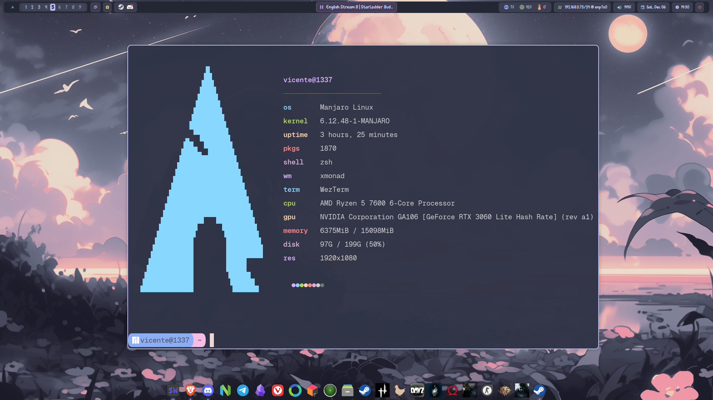
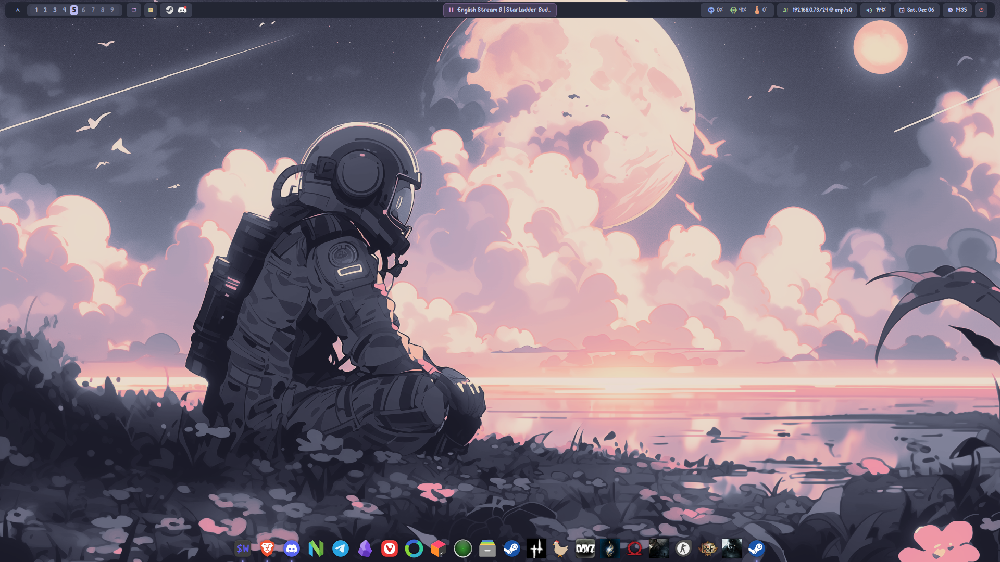

# XMonad Dotfiles

My personal XMonad setup with EWW bar, Catppuccin Frappe theme, and various tools for a complete desktop environment.

## Screenshots






## Features

- **XMonad** - Tiling window manager with custom keybindings and layouts
- **EWW** - Elkowar's Wacky Widgets for a modern, customizable bar
- **Catppuccin Frappe** - Beautiful pastel color scheme
- **Rofi** - Application launcher and dmenu replacement
- **Picom** - Compositor for transparency and animations
- **Dunst** - Notification daemon
- **Wezterm** - GPU-accelerated terminal emulator
- **Neovim** - Text editor with LazyVim configuration

## Structure

```
dotfiles/
├── .config/
│   ├── dunst/          # Notification daemon config
│   ├── eww/            # EWW bar widgets and styles
│   │   ├── eww.yuck    # Widget definitions
│   │   ├── eww.scss    # Styling (Catppuccin Frappe)
│   │   ├── launch.sh   # Bar launcher script
│   │   └── scripts/    # EWW helper scripts
│   ├── nvim/           # Neovim configuration (LazyVim)
│   ├── parcellite/     # Clipboard manager config
│   ├── picom/          # Compositor config
│   ├── rofi/           # Rofi launcher config
│   │   ├── config.rasi
│   │   ├── colors.rasi
│   │   ├── themes/
│   │   └── scripts/
│   └── tint2/          # Tint2 bar (alternative)
│       └── executor/   # Tint2 scripts
├── .scripts/           # Custom scripts
│   ├── screenshot-*.sh # Screenshot utilities
│   ├── change-volume.sh
│   └── change-brightness.sh
├── xmonad/             # XMonad configuration
│   ├── xmonad.hs       # Main config
│   ├── gaming-mode.sh  # Gaming mode toggle
│   ├── layout-*.sh     # Layout scripts
│   └── icons/          # XBM icons
├── .wezterm.lua        # Wezterm terminal config
└── .Xresources         # X11 resources
```

## Dependencies

### Core
- `xmonad` - Window manager
- `xmonad-contrib` - XMonad extensions
- `eww` - Widget system
- `rofi` - Launcher

### System
- `picom` - Compositor
- `dunst` - Notifications
- `nitrogen` - Wallpaper manager
- `xdotool` - X11 automation
- `playerctl` - Media controls

### Fonts
- JetBrainsMono Nerd Font
- Material Icons
- Vanilla Caramel (optional)

### Applications
- `wezterm` - Terminal
- `neovim` - Editor
- `parcellite` - Clipboard manager
- `pamixer` - Volume control
- `brightnessctl` - Brightness control
- `flameshot` or `scrot` - Screenshots

### Optional
- `tint2` - Alternative bar
- `plank` - Dock
- `redshift` - Blue light filter

## Installation

### 1. Clone the repository

```bash
git clone https://github.com/yourusername/dotfiles.git ~/github/dotfiles
cd ~/github/dotfiles
```

### 2. Install dependencies (Arch Linux)

```bash
# Core packages
sudo pacman -S xmonad xmonad-contrib eww rofi picom dunst nitrogen xdotool playerctl

# Applications
sudo pacman -S wezterm neovim parcellite pamixer brightnessctl

# Fonts
sudo pacman -S ttf-jetbrains-mono-nerd ttf-material-icons-git

# Optional
sudo pacman -S tint2 plank redshift
```

### 3. Create symlinks

```bash
# XMonad
ln -sf ~/github/dotfiles/xmonad ~/.xmonad

# Config files
ln -sf ~/github/dotfiles/.config/eww ~/.config/eww
ln -sf ~/github/dotfiles/.config/rofi ~/.config/rofi
ln -sf ~/github/dotfiles/.config/dunst ~/.config/dunst
ln -sf ~/github/dotfiles/.config/picom ~/.config/picom
ln -sf ~/github/dotfiles/.config/nvim ~/.config/nvim
ln -sf ~/github/dotfiles/.config/parcellite ~/.config/parcellite

# Home directory files
ln -sf ~/github/dotfiles/.wezterm.lua ~/.wezterm.lua
ln -sf ~/github/dotfiles/.Xresources ~/.Xresources

# Scripts
ln -sf ~/github/dotfiles/.scripts ~/.scripts
```

### 4. Compile XMonad

```bash
xmonad --recompile
```

### 5. Start/Restart XMonad

Log out and select XMonad from your display manager, or run:
```bash
xmonad --restart
```

## Keybindings

| Key | Action |
|-----|--------|
| `Super + Enter` | Open terminal |
| `Super + P` | Rofi launcher |
| `Super + Shift + C` | Close window |
| `Super + Space` | Cycle layouts |
| `Super + [1-9]` | Switch workspace |
| `Super + Shift + [1-9]` | Move window to workspace |
| `Super + H/L` | Resize master |
| `Super + J/K` | Focus next/prev window |
| `Super + Shift + J/K` | Swap windows |
| `Super + Shift + Q` | Quit XMonad |
| `Super + Q` | Restart XMonad |

## EWW Bar

The bar includes:
- **Left**: Logo, Workspaces, Layout indicator, Clipboard, System tray
- **Center**: Music player (playerctl)
- **Right**: System info (CPU, RAM, Temp), Network, Volume, Date, Clock, Power

### Bar Commands

```bash
~/.config/eww/launch.sh start   # Start the bar
~/.config/eww/launch.sh stop    # Stop the bar
~/.config/eww/launch.sh reload  # Reload the bar
~/.config/eww/launch.sh toggle  # Toggle the bar
```

## Color Scheme

Using **Catppuccin Frappe**:

| Color | Hex |
|-------|-----|
| Base | `#303446` |
| Text | `#c6d0f5` |
| Blue | `#8caaee` |
| Green | `#a6d189` |
| Yellow | `#e5c890` |
| Red | `#e78284` |
| Lavender | `#babbf1` |

## Credits

- [Catppuccin](https://github.com/catppuccin/catppuccin) - Color scheme
- [EWW](https://github.com/elkowar/eww) - Widget system
- [XMonad](https://xmonad.org/) - Window manager

## License

MIT License - feel free to use and modify as you wish.
