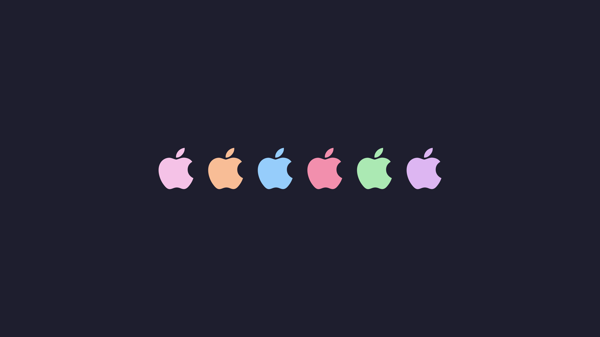
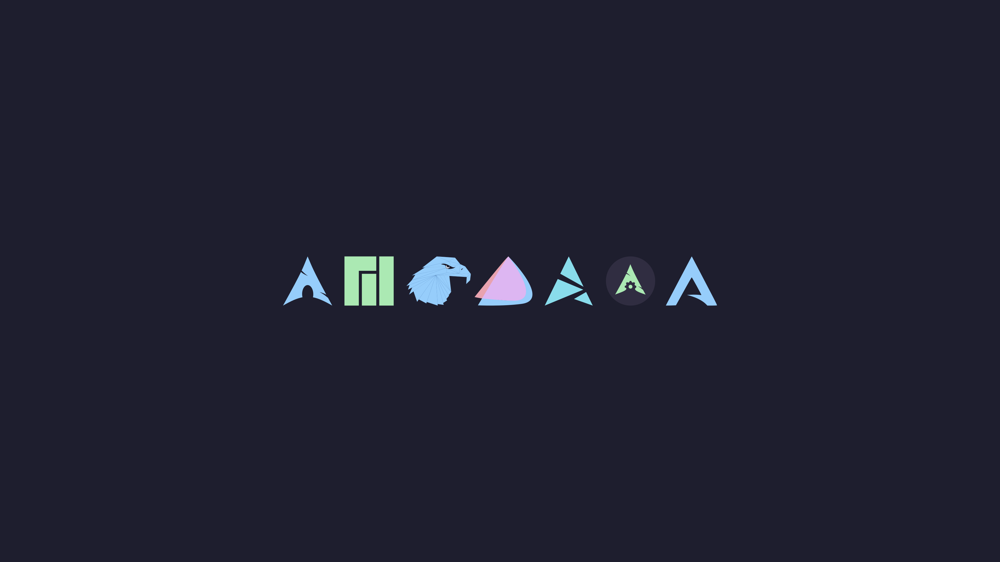
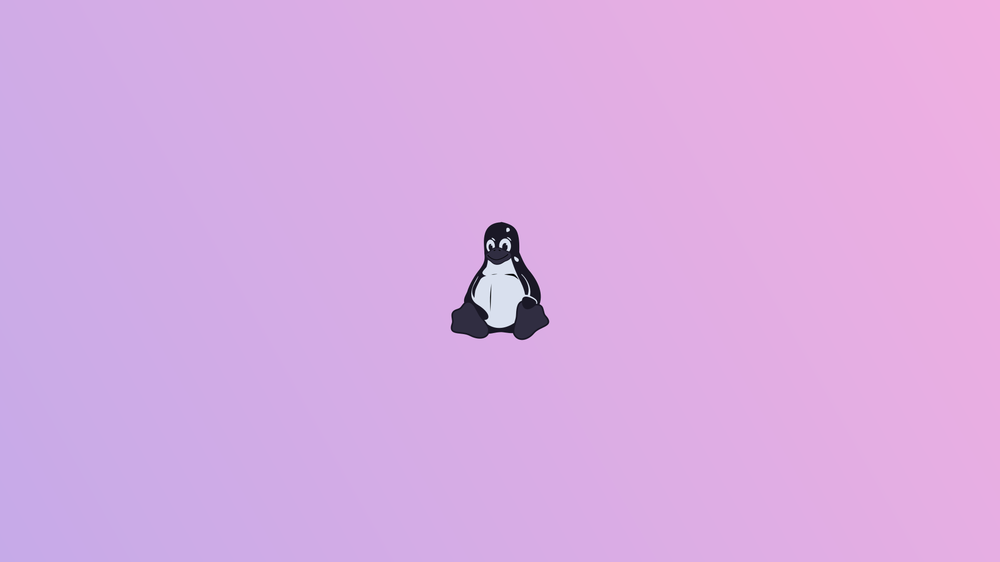
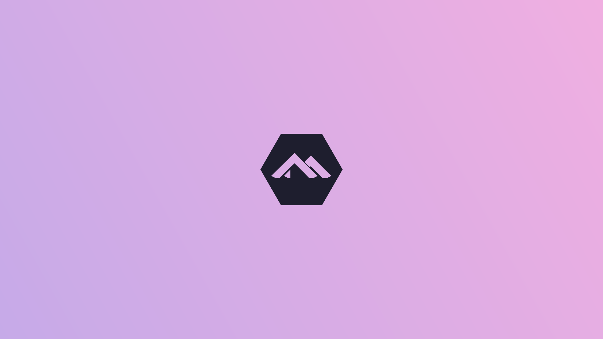
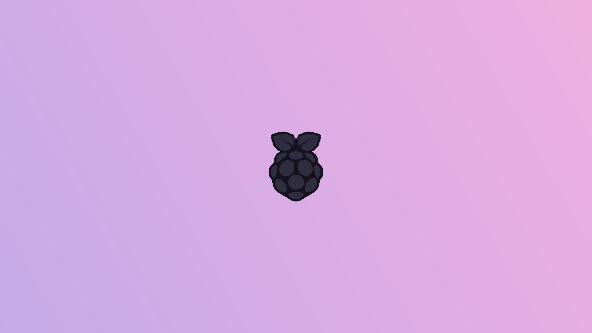

<h3>os</h3><table><thead><tr><th>Author</th></tr></thead><tbody><tr><td><a href="https://github.com/elkrien">elkrien</a></td></tr><tr><td></td></tr><tr><td><a href="https://github.com/elkrien">elkrien</a></td></tr><tr><td></td></tr><tr><td><a href="https://github.com/elkrien">elkrien</a></td></tr><tr><td></td></tr><tr><td><a href="https://github.com/elkrien">elkrien</a></td></tr><tr><td></td></tr><tr><td><a href="https://github.com/elkrien">elkrien</a></td></tr><tr><td></td></tr><tr><td><a href="https://github.com/elkrien">elkrien</a></td></tr><tr><td></td></tr><tr><td><a href="https://github.com/elkrien">elkrien</a></td></tr><tr><td></td></tr><tr><td><a href="https://github.com/elkrien">elkrien</a></td></tr><tr><td></td></tr><tr><td><a href="https://github.com/elkrien">elkrien</a></td></tr><tr><td></td></tr><tr><td><a href="https://github.com/elkrien">elkrien</a></td></tr><tr><td></td></tr><tr><td><a href="https://github.com/elkrien">elkrien</a></td></tr><tr><td></td></tr><tr><td><a href="https://github.com/elkrien">elkrien</a></td></tr><tr><td></td></tr><tr><td><a href="https://github.com/elkrien">elkrien</a></td></tr><tr><td></td></tr><tr><td><a href="https://github.com/elkrien">elkrien</a></td></tr><tr><td></td></tr><tr><td><a href="https://github.com/elkrien">elkrien</a></td></tr><tr><td></td></tr><tr><td><a href="https://github.com/elkrien">elkrien</a></td></tr><tr><td></td></tr><tr><td><a href="https://github.com/elkrien">elkrien</a></td></tr><tr><td></td></tr><tr><td><a href="https://github.com/elkrien">elkrien</a></td></tr><tr><td></td></tr><tr><td><a href="https://github.com/elkrien">elkrien</a></td></tr><tr><td></td></tr><tr><td><a href="https://github.com/elkrien">elkrien</a></td></tr><tr><td></td></tr><tr><td><a href="https://github.com/elkrien">elkrien</a></td></tr><tr><td></td></tr><tr><td><a href="https://github.com/elkrien">elkrien</a></td></tr><tr><td></td></tr><tr><td><a href="https://github.com/elkrien">elkrien</a></td></tr><tr><td></td></tr><tr><td><a href="https://github.com/elkrien">elkrien</a></td></tr><tr><td></td></tr><tr><td><a href="https://github.com/elkrien">elkrien</a></td></tr><tr><td></td></tr><tr><td><a href="https://github.com/elkrien">elkrien</a></td></tr><tr><td></td></tr><tr><td><a href="https://github.com/elkrien">elkrien</a></td></tr><tr><td></td></tr><tr><td><a href="https://github.com/elkrien">elkrien</a></td></tr><tr><td></td></tr><tr><td><a href="https://github.com/elkrien">elkrien</a></td></tr><tr><td></td></tr><tr><td><a href="https://github.com/elkrien">elkrien</a></td></tr><tr><td></td></tr><tr><td><a href="https://github.com/ShyyLexi">Lexi</a></td></tr><tr><td></td></tr><tr><td><a href="https://github.com/elkrien">elkrien</a></td></tr><tr><td></td></tr><tr><td><a href="https://github.com/elkrien">elkrien</a></td></tr><tr><td></td></tr><tr><td><a href="https://github.com/elkrien">elkrien</a></td></tr><tr><td></td></tr><tr><td><a href="https://github.com/elkrien">elkrien</a></td></tr><tr><td></td></tr><tr><td><a href="https://github.com/elkrien">elkrien</a></td></tr><tr><td></td></tr><tr><td><a href="https://github.com/elkrien">elkrien</a></td></tr><tr><td></td></tr><tr><td><a href="https://github.com/elkrien">elkrien</a></td></tr><tr><td></td></tr><tr><td><a href="https://github.com/elkrien">elkrien</a></td></tr><tr><td></td></tr><tr><td><a href="https://github.com/elkrien">elkrien</a></td></tr><tr><td></td></tr><tr><td><a href="https://github.com/elkrien">elkrien</a></td></tr><tr><td></td></tr><tr><td><a href="https://github.com/elkrien">elkrien</a></td></tr><tr><td></td></tr><tr><td><a href="https://github.com/elkrien">elkrien</a></td></tr><tr><td></td></tr><tr><td><a href="https://github.com/elkrien">elkrien</a></td></tr><tr><td></td></tr><tr><td><a href="https://github.com/elkrien">elkrien</a></td></tr><tr><td></td></tr><tr><td><a href="https://github.com/elkrien">elkrien</a></td></tr><tr><td></td></tr><tr><td><a href="https://github.com/elkrien">elkrien</a></td></tr><tr><td></td></tr><tr><td><a href="https://github.com/elkrien">elkrien</a></td></tr><tr><td></td></tr><tr><td><a href="https://github.com/elkrien">elkrien</a></td></tr><tr><td></td></tr><tr><td><a href="https://github.com/elkrien">elkrien</a></td></tr><tr><td></td></tr><tr><td><a href="https://github.com/elkrien">elkrien</a></td></tr><tr><td></td></tr><tr><td><a href="https://github.com/TGRush">TGRush</a></td></tr><tr><td></td></tr><tr><td><a href="https://github.com/elkrien">elkrien</a></td></tr><tr><td></td></tr><tr><td><a href="https://github.com/elkrien">elkrien</a></td></tr><tr><td></td></tr><tr><td><a href="https://github.com/elkrien">elkrien</a></td></tr><tr><td></td></tr><tr><td><a href="https://github.com/elkrien">elkrien</a></td></tr><tr><td></td></tr><tr><td><a href="https://github.com/elkrien">elkrien</a></td></tr><tr><td></td></tr><tr><td><a href="https://github.com/elkrien">elkrien</a></td></tr><tr><td></td></tr><tr><td><a href="https://github.com/elkrien">elkrien</a></td></tr><tr><td></td></tr><tr><td><a href="https://github.com/elkrien">elkrien</a></td></tr><tr><td></td></tr><tr><td><a href="https://github.com/elkrien">elkrien</a></td></tr><tr><td></td></tr><tr><td><a href="https://github.com/elkrien">elkrien</a></td></tr><tr><td></td></tr><tr><td><a href="https://github.com/elkrien">elkrien</a></td></tr><tr><td></td></tr><tr><td><a href="https://github.com/elkrien">elkrien</a></td></tr><tr><td></td></tr><tr><td><a href="https://github.com/elkrien">elkrien</a></td></tr><tr><td></td></tr><tr><td><a href="https://github.com/elkrien">elkrien</a></td></tr><tr><td></td></tr><tr><td><a href="https://github.com/elkrien">elkrien</a></td></tr><tr><td></td></tr><tr><td><a href="https://github.com/elkrien">elkrien</a></td></tr><tr><td></td></tr><tr><td><a href="https://github.com/elkrien">elkrien</a></td></tr><tr><td></td></tr><tr><td><a href="https://github.com/ShyyLexi">Lexi</a></td></tr><tr><td></td></tr><tr><td><a href="https://github.com/elkrien">elkrien</a></td></tr><tr><td></td></tr><tr><td><a href="https://github.com/elkrien">elkrien</a></td></tr><tr><td></td></tr><tr><td><a href="https://github.com/elkrien">elkrien</a></td></tr><tr><td></td></tr><tr><td><a href="https://github.com/elkrien">elkrien</a></td></tr><tr><td></td></tr><tr><td><a href="https://github.com/elkrien">elkrien</a></td></tr><tr><td></td></tr><tr><td><a href="https://github.com/ShyyLexi">Lexi</a></td></tr><tr><td></td></tr><tr><td><a href="https://github.com/elkrien">elkrien</a></td></tr><tr><td></td></tr><tr><td><a href="https://github.com/elkrien">elkrien</a></td></tr><tr><td></td></tr><tr><td><a href="https://github.com/elkrien">elkrien</a></td></tr><tr><td></td></tr><tr><td><a href="https://github.com/elkrien">elkrien</a></td></tr><tr><td></td></tr><tr><td><a href="https://github.com/elkrien">elkrien</a></td></tr><tr><td></td></tr><tr><td><a href="https://github.com/elkrien">elkrien</a></td></tr><tr><td></td></tr><tr><td><a href="https://github.com/elkrien">elkrien</a></td></tr><tr><td></td></tr><tr><td><a href="https://github.com/elkrien">elkrien</a></td></tr><tr><td></td></tr><tr><td><a href="https://github.com/elkrien">elkrien</a></td></tr><tr><td></td></tr><tr><td><a href="https://github.com/elkrien">elkrien</a></td></tr><tr><td></td></tr><tr><td><a href="https://github.com/elkrien">elkrien</a></td></tr><tr><td></td></tr><tr><td><a href="https://github.com/elkrien">elkrien</a></td></tr><tr><td></td></tr><tr><td><a href="https://github.com/elkrien">elkrien</a></td></tr><tr><td></td></tr><tr><td><a href="https://github.com/elkrien">elkrien</a></td></tr><tr><td></td></tr><tr><td><a href="https://github.com/elkrien">elkrien</a></td></tr><tr><td></td></tr></tbody></table>